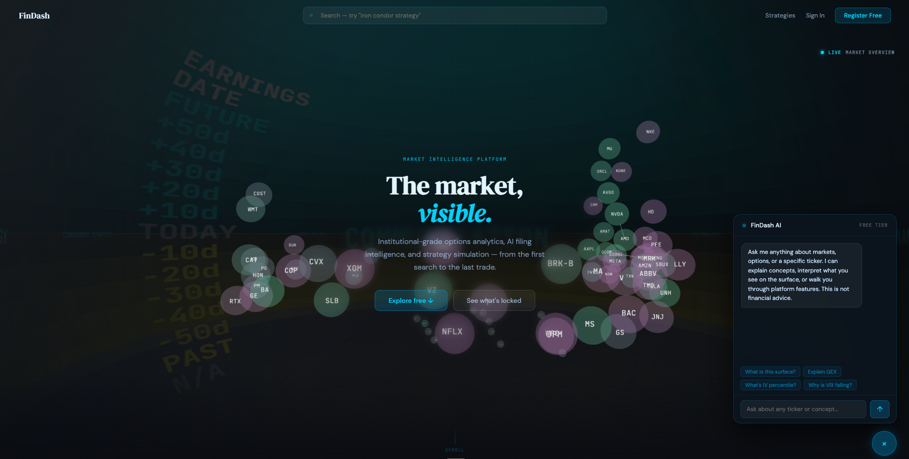
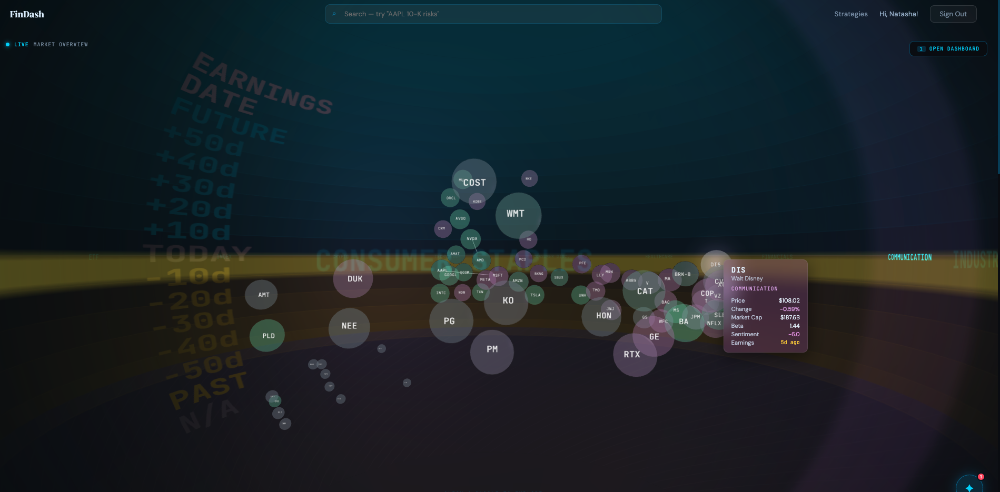
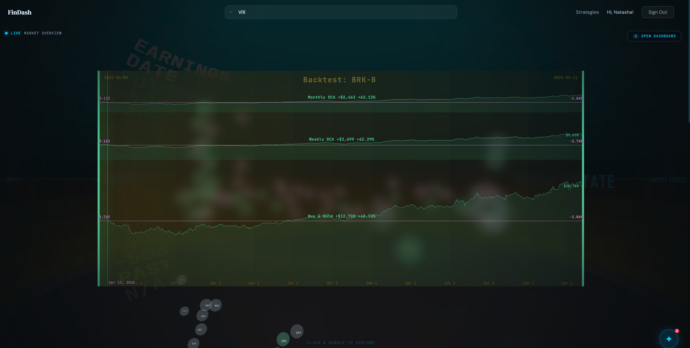
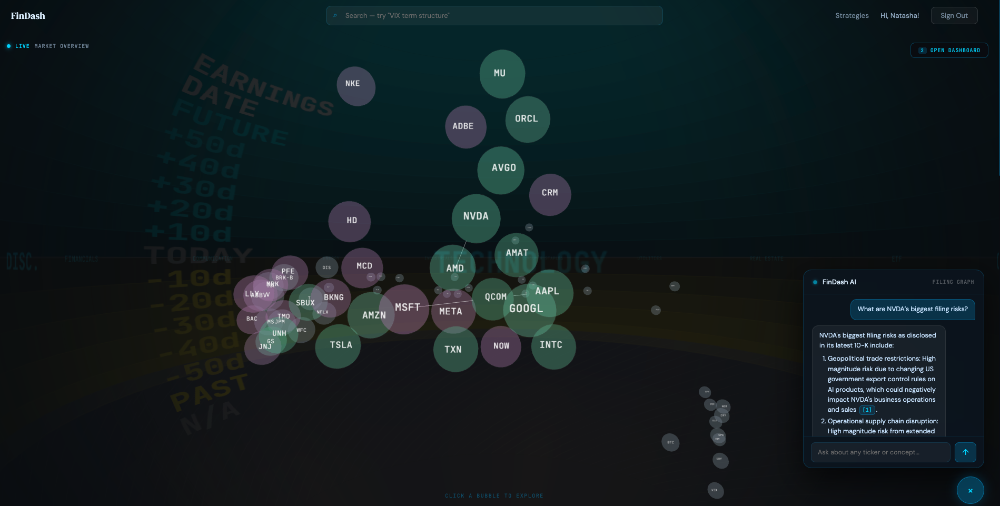
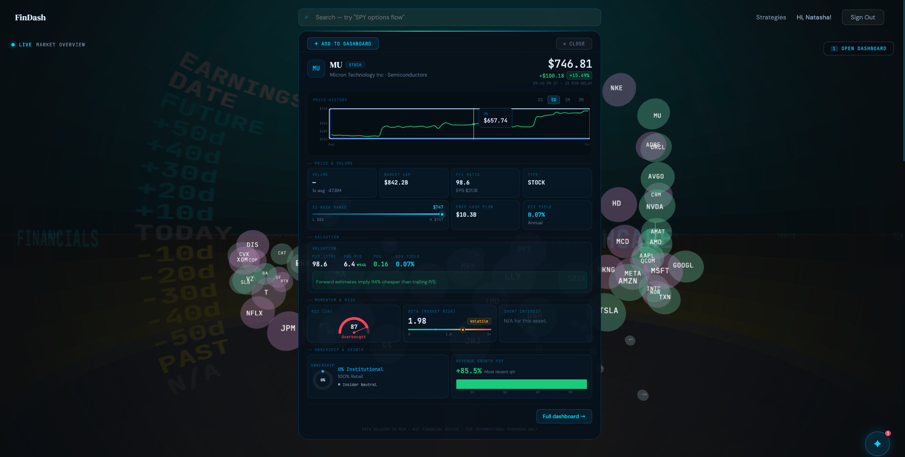
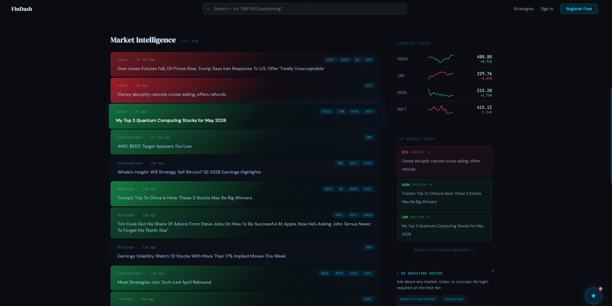
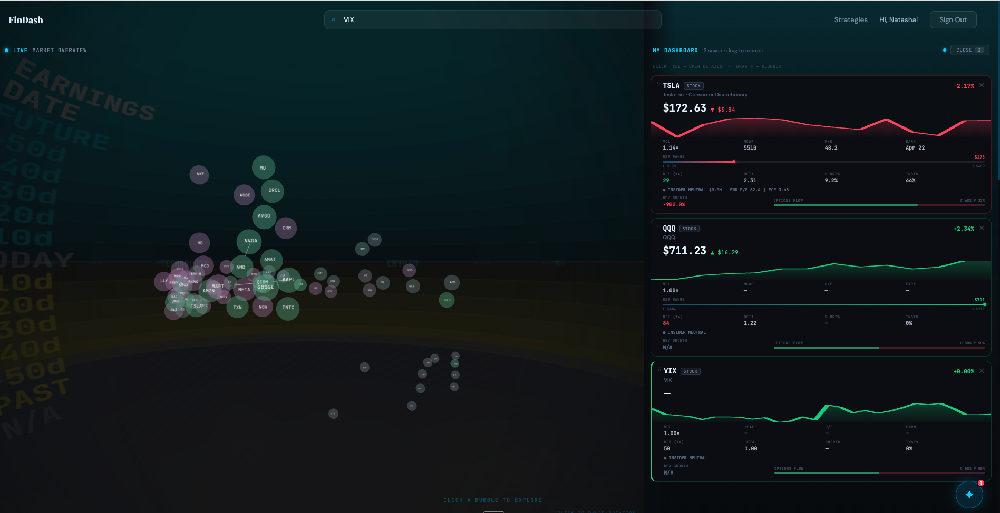
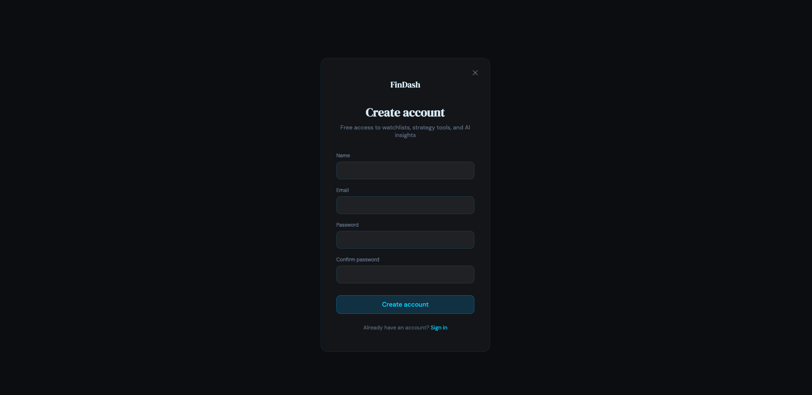

<h1 align="center">FinDash 💹</h1>
<p align="center">
  <b>A freemium financial intelligence platform combining GraphRAG-grounded SEC filing analysis, 3D market visualization, and strategy backtesting.</b>
</p>

<p align="center">
  <a href="https://fin-dash.azurewebsites.net/"></a>
</p>

<p align="center">
  
  
  
  
  
  
  
  
  
</p>

<p align="center">
  
</p>

> **NYU CS-GY 6063 Software Engineering Capstone · Spring 2026** · Built by a team of 6. Showcase repo with screenshots, write-up, and a link to the live deployment. My focus areas: frontend components (asset search, detail panel, news feed) and UX decisions across the visual surface. Production code lives in our team's private repo.

> 🔗 **Try it live:** [fin-dash.azurewebsites.net](https://fin-dash.azurewebsites.net/) *(free tier may take ~30s to wake)*

---

## ✨ Features

### 🌌 3D Market Constellation
A live 3D bubble graph built in Three.js. Sector angle drives polar position (θ in the XZ plane), days-to-earnings drives the vertical axis (−120 days at the bottom, +120 at the top), and market cap encodes bubble size via a `sqrt(log(marketCap))` scale. Daily change drives a diverging color gradient; sentiment score drives an additional glow layer.

Hovering a bubble casts its shadow onto a vertical time-wall plane behind the scene (past = yellow, today = white, future = cyan). Glowing white edges connect companies that share extracted entities in the GraphRAG layer, surfacing structural relationships across the market.

<p align="center">
  
</p>

### 🌀 Constellation-to-Vortex Backtesting
The product's signature interaction. Authenticated users grab a stock bubble out of the constellation and drag it into a swirling vortex at the bottom of the screen. Dropping the stock triggers a translucent 3D ribbon overlay above the constellation, animating the backtest *without leaving the spatial context*.

The ribbon visualization runs three axes simultaneously: time along X, position equity value along Y, and depth along Z (with constituent strategy legs spreading along Z when a position is expanded). Gain/loss is computed per-segment with green/red coloring, and inline date-range knobs let users scrub the simulation window without leaving the surface. Three strategies are supported in v1 — buy-and-hold, weekly DCA, monthly DCA — computed in a Django backend simulator with an Azure SQL price cache.

<p align="center">
  
</p>

### 🧠 GraphRAG-Grounded Filing Intelligence
For authenticated users, the chatbot routes through a Neo4j + Qdrant + MongoDB GraphRAG pipeline. The current corpus covers **50 S&P 500 companies, 268 SEC filings, 33,155 cited evidence chunks**, and 2,102 detected semantic drift events between filing periods.

The pipeline uses a three-layer extraction approach rather than a single vector-search step:

1. **Controlled risk ontology** — maps passages to 53 specific categories (e.g., `RISK.GEOPOLITICAL.TRADE_RESTRICTIONS`), recording direction, magnitude, and exact framing
2. **Open-ended entity extraction** — identifies 3,131 unique real-world entities (FDA, TSMC, specific jurisdictions) so the system picks up novel concepts as they appear in new filings
3. **Semantic drift detection** — compares framing language across time, flagging when a company's risk language shifts meaningfully between periods

This lets the chatbot answer questions like *"What supply chain risks has NVIDIA disclosed over the last three filings, and has the language gotten more severe?"* with disclosed risks ranked by prominence, grounded in quoted passages. Every claim ties back to a specific filing, section, period, and verbatim evidence passage with a clickable SEC source link.

<p align="center">
  
</p>

### 📊 Asset Search & Detail Panel
Autocomplete search across U.S. equities, ETFs, and crypto. Clicking any constellation bubble (or search result) triggers a hero-to-panel split layout with live price, 1D / 1W / 1M / 3M / 1Y / 5Y charts backed by yfinance, valuation metrics (P/E TTM, forward P/E, PEG, dividend yield), momentum indicators (RSI gauge, beta with volatility classification, short interest), and ownership/growth breakdowns.

<p align="center">
  
</p>

### 📰 Sentiment-Graded News Feed
Finnhub-backed news strip with rank-normalized sentiment coloring — articles are colored by *rank* within the feed rather than raw score, so contrast is guaranteed regardless of how tight the score distribution is. The most bearish article is always the deepest red; the most bullish is always the deepest green. Ticker tags surface affected names; the side panel pairs each article with the impacted stocks' live price and a top-signals summary.

<p align="center">
  
</p>

### 👤 Authenticated Tier & Watchlist Dashboard
JWT-based authentication issues an in-memory access token paired with an httpOnly refresh cookie. Logged-in users get a server-persisted watchlist (Azure SQL), a drag-to-reorder dashboard with live ticker tiles, and access to the GraphRAG chatbot and 3D backtesting surface.

<p align="center">
  
</p>

---

## 🏗️ System architecture

```
┌─────────────────────────────────────────────────────────┐
│  Frontend (React + TypeScript + Three.js + Vite)        │
│  ├── 3D Constellation                                   │
│  ├── Backtest Ribbons (constellation-to-vortex)         │
│  ├── Asset Detail Panel                                 │
│  ├── News Feed (sentiment-graded)                       │
│  └── Chat UI (citation renderer)                        │
└──────────────────────┬──────────────────────────────────┘
                       │ JSON / JWT
┌──────────────────────▼──────────────────────────────────┐
│  Backend (Django + DRF + SimpleJWT)                     │
│  ├── /api/auth/  (JWT + httpOnly refresh cookie)        │
│  ├── /api/assets/ (yfinance proxy + PriceCache)         │
│  ├── /api/watchlist/                                    │
│  ├── /api/backtest/  (3 strategy legs)                  │
│  └── /api/chat/  → GraphRAG service OR Azure OpenAI     │
└────────┬─────────────────────────────┬──────────────────┘
         │                             │
┌────────▼────────┐         ┌──────────▼──────────────────┐
│  Azure SQL      │         │  GraphRAG Pipeline          │
│  (App State)    │         │  ├── Neo4j (knowledge graph)│
│  ├── Users      │         │  ├── Qdrant (embeddings)    │
│  ├── Watchlist  │         │  ├── MongoDB (extraction)   │
│  └── PriceCache │         │  └── Azure OpenAI (synth)   │
└─────────────────┘         └─────────────────────────────┘
                                       │
                          ┌────────────▼─────────────────┐
                          │  50 companies, 268 filings,  │
                          │  33,155 evidence chunks,     │
                          │  2,102 drift alerts          │
                          └──────────────────────────────┘

         Deployed via GitHub Actions → Azure App Service
```

---

## 🛠️ Tech stack

| Layer | Technology |
|---|---|
| Frontend | React 18 · TypeScript · Vite · Three.js (raw, not r3f) · Recharts |
| Backend | Django 5 · Django REST Framework · SimpleJWT · WhiteNoise |
| App Database | Azure SQL Database (SQLite fallback for offline dev) |
| Filing Graph | Neo4j · Qdrant · MongoDB · Azure OpenAI |
| Data | yfinance · Finnhub API |
| Deployment | Azure App Service · GitHub Actions CI/CD |
| Testing | Django test framework (112 tests) · pytest (41 GraphRAG tests) · Playwright E2E |

---

## 📈 By the numbers

- **170+ commits** across the team's release branch over the semester
- **15+ production deployments** via GitHub Actions to Azure App Service
- **84 tracked files** in the web repo (41 backend, 34 frontend, 6 root, 3 scripts)
- **112 backend tests + 41 GraphRAG pipeline tests** — all passing
- **6 contributors** across 7 active branches with PR-based code review
- **27 commits in a single day** at peak intensity during the final sprint

---

## 📸 More screenshots

<p align="center">
  <b>Landing page — 3D constellation + general chatbot</b><br>
  
</p>

<p align="center">
  <b>Account creation</b><br>
  
</p>

---

## 🤔 What didn't make the cut (and why)

Honest scope reflection from the team's final report — the original requirements doc had 20 user stories. These features were deferred:

- **Full options chain with Greeks & IV percentile** — reliable real-time options data is gated behind paid APIs that didn't fit the project budget. The team reinvested that time into the GraphRAG pipeline and the constellation-to-vortex interaction
- **3D options positioning surface (GEX, max-pain bands)** — dependent on the live options data above
- **Historical simulation environment** — pick a past date, every data surface respects information available before it. The constellation-to-vortex backtesting is the foundation for this
- **Strategy DSL** — reusable strategy definitions in relative parameters; v1 ships three hard-coded legs as the foundation
- **Multi-watchlist semantics** — currently one persisted watchlist per user; named multi-watchlist scaffolding is in place

The platform delivers the core of every user persona's workflow. Deferred features deepen each persona's experience but don't break the platform for any of them.

---

## 👥 Team

FinDash was built collaboratively by 6 NYU graduate students:

- **Khushi Agarwal** (me)
- **Adam Wardak**
- **Buddhsen Tripathi**
- **Het Somaiya**
- **Natasha Sebastian**
- **Yukang Luo**

Course: **CS-GY 6063 — Software Engineering I** · Spring 2026 · Professor Raz Saremi · NYU Tandon School of Engineering

---

<p align="center">
  <i>The production code is private to the team. This repo documents the work and links to the live deployment.</i><br>
  <a href="https://fin-dash.azurewebsites.net/">→ Try it live</a>
</p>
